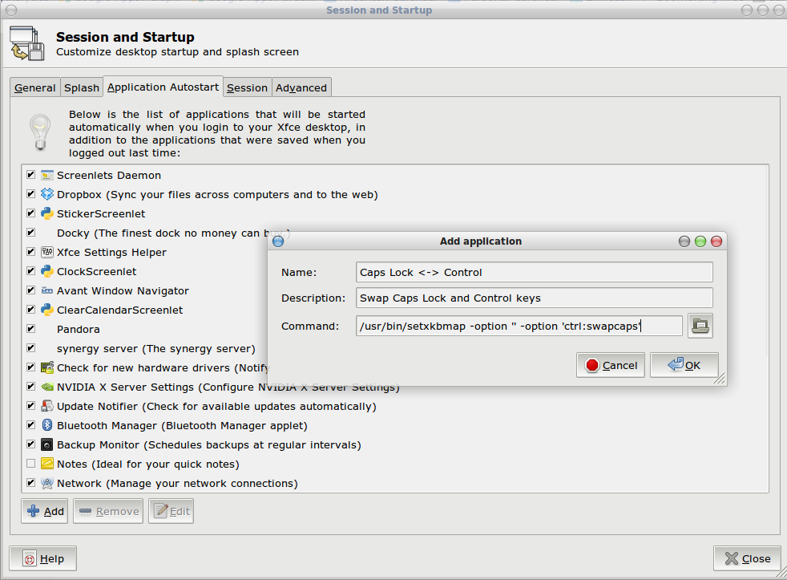

# Fuzzy antialiasing

Select *Settings > Appearance* and, under the *Fonts* tab, play with the
*Sub-pixel order* setting.

# Keyboard

## Keyboard shortcuts

The default set, in XFCE4: <http://www.keyxl.com/aaac887/409/Xfce-Window-Manager-keyboard-shortcuts.htm>

## Emacs key bindings

    xfconf-query -c xsettings -p /Gtk/KeyThemeName -s Emacs

## Swap Control and Caps Lock Keys

Option 1: Make the Caps Lock key another control key (with no Caps Lock key)

    /usr/bin/setxkbmap -option 'ctrl:nocaps'

Option 2: Swap them

    /usr/bin/setxkbmap -option 'ctrl:swapcaps'

Note: *setxkbmap* is additive. To clear previous set options, use an empty
argument first:

    /usr/bin/setxkbmap -option '' -option 'ctrl:swapcaps'

To make sure this happens every time XFCE4 comes up, add an entry to
*Settings > Session and Startup > Application Autostart*, as shown below.

Another option is to use *xmodmap*. For instance, the following input maps
the Caps Lock key to Control, leaves the Control keys alone, and maps the Pause
key (which I never use) to Caps Lock:

    remove Lock = Caps_Lock
    keycode 66 = Control_L Control_L Control_L
    add Control = Control_L
    keycode 127 = Caps_Lock

# Thunar (File Manager)

## Change default application

Easiest solution: Edit `~/.local/share/applications/defaults.list` and
add the appropriate entries. For instance, to force VLC as the default movie
player, you might change the `defaults.list` file to look like this:

    [Default Applications]
    text/html=google-chrome.desktop
    video/mp4=vlc.dekstop
    video/mp4v-es=vlc.dekstop
    video/x-ms-wmv=vlc.dekstop
    video/quicktime=vlc.dekstop

See `/etc/mime.types` for appropriate MIME types.

# Panels

## Autohide quits working

Reset the panel:

    $ xfce4-panel -r
